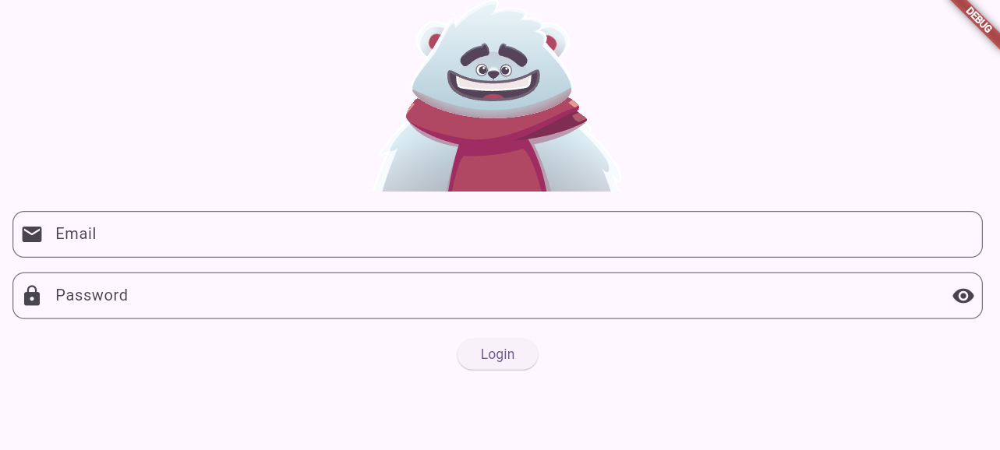
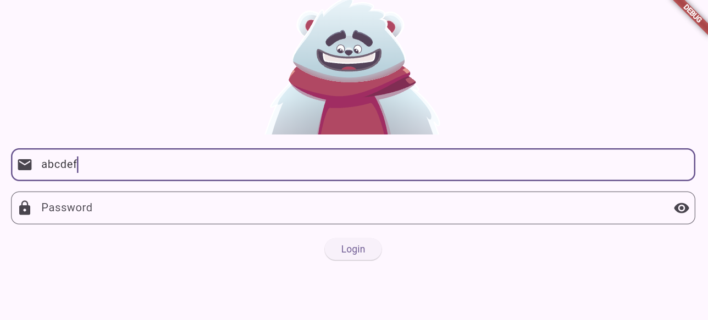
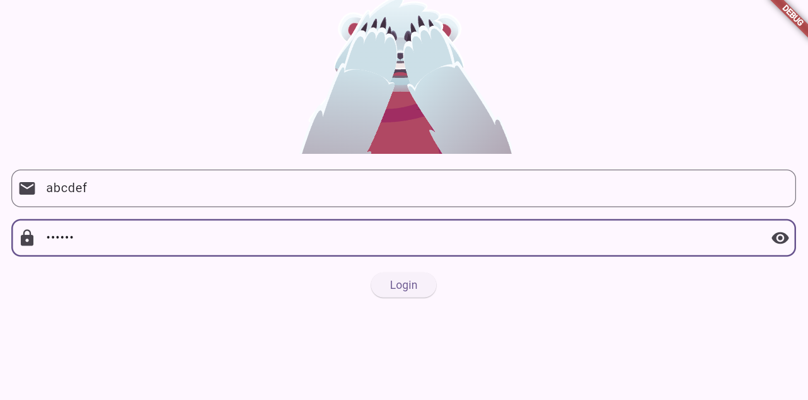

# 🎯 Flutter Login Animation con Rive

Aplicación desarrollada en **Flutter (Dart)** que implementa una pantalla de inicio de sesión animada utilizando **Rive** para integrar animaciones interactivas y mejorar la experiencia del usuario.

---

## 📱 Descripción del Proyecto

Este proyecto consiste en una interfaz de login moderna e interactiva donde se utiliza una animación creada en **Rive** que responde dinámicamente a las acciones del usuario.

La animación cambia de estado dependiendo de la interacción con los campos de texto (por ejemplo: cuando el usuario escribe el correo, cuando ingresa la contraseña o cuando se activa una validación).

El propósito principal del proyecto fue comprender cómo integrar animaciones avanzadas en Flutter y conectarlas con la lógica de la aplicación.

---

## 🎥 Demo del Proyecto


---

## 🖼️ Capturas de Pantalla







---

## 🛠️ Tecnologías Utilizadas

- 💙 Flutter  
- 🎯 Dart  
- 🎨 Rive  
- 📱 Material Design  

---

## 📦 Dependencias Principales

```
yaml
dependencies:
  flutter:
    sdk: flutter
  rive: ^0.x.x
```

---

## 📁 Estructura del Proyecto

```
📂 login_with_rive_animation_5sa_26_1/
 ├── lib/
 │   ├── main.dart
 │   ├── login_screen.dart
 │
 ├── assets/
 │   ├── animations/
 │       ├── archivo_animacion.riv
 │
 ├── pubspec.yaml
 ├── README.md
```

---

## 🚀 Instalación y Ejecución

### 1️⃣ Clonar el repositorio

```
bash
git clone https://github.com/JAro05x/login_with_rive_animation_5sa_26_1.git
```

### 2️⃣ Entrar al directorio del proyecto

```
bash
cd login_with_rive_animation_5sa_26_1
```

### 3️⃣ Instalar dependencias

```bash
flutter pub get
```

### 4️⃣ Ejecutar la aplicación

```bash
flutter run
```

---

## 🎨 Implementación de Rive

La animación se carga desde los assets utilizando:

```
dart
RiveAnimation.asset(
  'assets/animations/archivo_animacion.riv',
  fit: BoxFit.cover,
)
```

Se utiliza un `StateMachineController` para manipular los estados de la animación dependiendo de la interacción del usuario.

Ejemplo general de controlador:

```
dart
StateMachineController.fromArtboard(
  artboard,
  'State Machine Name',
);
```

### Esto permite:

- Activar animaciones cuando el usuario interactúa con los campos.
- Cambiar estados booleanos dentro de la máquina de estados.
- Disparar triggers de animación.
- Controlar la lógica visual desde el código Dart.

---

## 🧠 Funcionamiento General

- La aplicación inicia desde `main.dart`.
- Se carga la pantalla de login.
- Se inicializa la animación de Rive.
- Se conecta el controlador de la máquina de estados.
- La animación responde dinámicamente a la interacción del usuario.

---

## 🎯 Objetivos del Proyecto

- Integrar animaciones interactivas con Rive en Flutter.
- Conectar la lógica de la aplicación con estados visuales.
- Diseñar una interfaz atractiva y moderna.
- Practicar estructura y organización de proyectos Flutter.

---

## 🧠 Aprendizajes Obtenidos

- Cómo importar y configurar archivos `.riv`.
- Cómo trabajar con `StateMachineController`.
- Cómo conectar inputs y triggers de Rive con eventos en Flutter.
- Organización de archivos en un proyecto Flutter.
- Manejo de assets y dependencias.

---

## 🔮 Posibles Mejoras Futuras

- Implementar validación real conectada a un backend.
- Agregar navegación a una pantalla principal después del login.
- Hacer la interfaz responsiva para distintos tamaños de pantalla.
- Añadir animaciones adicionales para errores o éxito.
- Optimizar arquitectura usando patrones como Provider o Bloc.

---

## 👨‍💻 Autor

**José Antonio Rosado Osorio**

---
